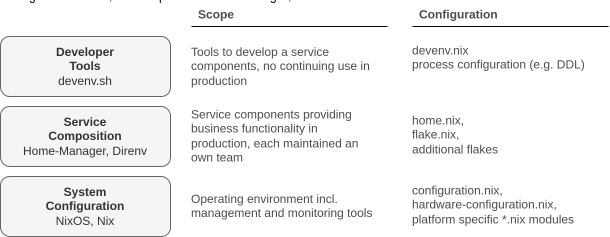

# Engineering Sandbox

This repository provides an opinionated and foundational configuration, designed to empower operations and cloud engineers in effortlessly setting up developer sandboxes. It streamlines the development of hybrid cloud services by enabling clear resource compositions that combine existing hosted applications with containerized applications destined for cloud deployment. While the core sandbox environment is built using NixOS for robust and reproducible setups, its flexibility allows it to run seamlessly across various platforms. Developers can leverage this framework on Windows (via WSL), ChromeOS (via CROSH), and macOS by utilizing the Nix package manager.

#### Design Criteria

* Independence from any orchestration tools or hosting services that dictate the operating model for a service in production.
* Flexible system configuration enabling independent rollouts across diverse hardware platforms.
* Secure package distribution via a cache, ensuring supply chain control for non-interactive, unattended updates.
* Declarative system configurations that enable fast roll back in case of a malfunction.

## Technology Stack

The nix packet manager enables software deployments through a functional system-configuration language and can be distributed through git repositories. This simplifies code sharing and eases the transition from development and testing to production. System declarations eliminate the need for configuration and deployment tools like Ansible and Terraform, and do not obligate the use of a platform orchestrators like Kubernetes but empower operators to decide on the optimal delivery method based on the operational context. Unlike traditional infrastructure-as-code and platform automation tools that merge application requirements, system definitions, and implementation instructions in a single code base, system modules keep application requirements separate from system- and cloud-provider dependencies to enable operators enforcing security policies and validating regulatory compliance before launching a service.



A layered architecture allows system engineers to design service blueprints that integrate host-dependent services, such as databases, with node artifacts deployable as distributed systems in clusters or serverless environments. This architecture maintains deployment model flexibility, allowing decisions to be made later in the process. The first layer defines the hosting platform with a separate hardware- and system configuration module. It remains decoupled from the application set to prevent platform dependencies. Additional modules can be utilized to reflect context specific maschine requirements, like mobility functions, cloud provider settings or company specific monitoring agents. The second layer defines solution components incl. hosted backend services, and the third layer addresses the development toolset and captures configurations for developer services. Local machine provisioning empowers engineers to override default settings at any layer, enabling security operators and service architects to test the entire stack with a functional model before staging and production. Local instances also eliminate implicit dependencies on higher level packaging formats and provider specific orchestrators, fostering a decentralized development process with configuration templates shared via Git. Programmatic assembly of dedicated servers ensures reproducibility, isolation, and atomic upgrades with consistent package deployments, independent of specific vendors or solutions. Dependencies and build instructions are specified in configuration files, facilitating clear separation of duties through simple directory or file access management.

## System Configuration

At its core, the sandbox employs a minimal Linux operating system, providing only essential hardware communication components. A dynamic package loader, governed by application platform requirements, then adds necessary packages using templates, eliminating the need for external orchestrators, custom packaging, or specific communication patterns. This approach allows operations teams to centrally manage system designs while delegating deployment, and to track and revert system configurations like immutable artifacts, all without abstracting the runtime environment, network, or storage interfaces. The default system is a NixOS server, however access to a Linux container like the [Windows Subsystem](https://learn.microsoft.com/en-us/windows/wsl/about) or [ChromeOS Shell](https://chromeos.dev/en/linux) is sufficient. Virtual environments require enough space to cache the platform components, a minimum size of *80 to 120GB* is recommended. Nevertheless, this really depends on the number and the complexity of the service blueprints that are being developed. MacOS users can either rely on a virtual to maintain an isolated subsystem or utilize to [Nix Darwin](https://github.com/LnL7/nix-darwin) project.

```ǹix
home.packages = with pkgs; [
  devenv       # https://devenv.sh/
  gnumake      # https://www.gnu.org/software/make/manual/make.html
  # lunarvim   # https://www.lunarvim.org/
  # zed-editor # https://zed.dev/
];
```

The sandbox utilizes a package manager, such as [Nix](https://github.com/NixOS/nix), [Lix](https://lix.systems/) or [Tvix](https://tvix.dev/), to assemble a set of solution components. Packages load additional software, the functional [programming language](https://nix.dev/tutorials/nix-language.html) defines and automates provisioning processes via executable templates. Available packages are listed at the [package directory](https://search.nixos.org/packages) and the command `nix-env -qaP` provides a list incl. available attributes for sripting. Engineers define [system configurations](https://nix.dev/tutorials/packaging-existing-software.html) using declarative files, ensuring isolated dependencies and creating clean, reproducible systems without the overhead of virtual machines or containers. `Override` functions enable engineers to build packages from source by processing additional attributes.

## Service Composition

Service composition base templates are managed using [**Home-Manager**](https://nix-community.github.io/home-manager/), a tool that allows users to declaratively manage their home directory including environment settings. It provides a structured way to organize and maintain dotfiles for various applications that reside in a user's home directory and enables the installation of solution-specific software packages, separate from system-wide installations to support customized software environments that do affecting the system configuration. Home manager supports two ways of deploying applications, programs and packages. For a develoment environment `programs` are the prefered method, nix modules that install the software and configure system wide features. Home manager [option search](https://home-manager-options.extranix.com/) lists all available programs for engineers.

## Developer Tools

Home manager is extended with [**Direnv**](https://direnv.net/), a tool that extends default- with user specific configurationa and dynamically loads or unloads system configurations based on directory changes. Nix's virtual filesystem ensures dependency isolation between software packages, enhancing stability. Direnv uses the .envrc file to reference configurations that automatically trigger provisioning. Upon entering a directory for the first time, a flag must be set to allow Direnv to monitor configuration changes and load the defined tools. Subsequently, Direnv checks for the .envrc file and, if present, makes the defined variables available in the current shell. While Nix offers various methods for separating environment definitions, Direnv only requires a reference to the configuration file within .envrc. **[Devenv.sh](https://devenv.sh/)** is a configuration tool that allows engineers to define these development environments declaratively by toggling basic options for nix and process-compose. Devenv leverages Nix to create reproducible development environments, it is an extension of the Nix ecosystem, tailored for development workflows. A development environment is defined by creating a directory, setting up a git repository, and sharing the repository with other developers via Github. Applications are executed, calling the process manager with the following command:

```sh
devenv up
```

## Tools

* [NixOS](https://nixos.org/)
* [Home Manager](https://nix-community.github.io/home-manager/)
* [Devenv.sh](https://devenv.sh/)
* [Direnv](https://direnv.net/)

## Contribution
* *Add features* If you have an idea for a new feature, please [open an issue](https://github.com/hcops/sandbox/issues/new) to discuss it before creating a pull request.
* *Report bugs* If you find a bug, please [open an issue](https://github.com/hcops/sandbox/issues/new) with a clear description of the problem.
* *Fix bugs* If you know how to fix a bug, submit a [pull request](https://github.com/hcops/sandbox/pull/new) with your changes.
* *Improve documentation* If you find the documentation lacking, you can contribute improvements by editing the relevant files.
