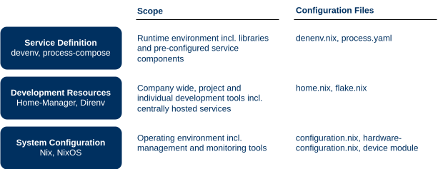

# Developer Sandbox

Developing hybrid cloud services is challenging because developers lack an Internal Developer Platform (IDP) to replicate production setups. Mismatches in networking, service discovery, and dependency management often lead to endless regression testing and delayed go-live. This repository provides a foundation for a local developer sandbox — an opinionated, foundational configuration designed to empower platform enigneers with more flexibility. Developers compose resources locally, mixing on-premise-hosted applications with cloud-bound containers, while persistent backing services remain in hosted environments. The sandbox utilizes the Nix package manager. It is built for NixOS to ensure robust reproducibility, but with the exception of UI applications, it can also be provisioned on [Windows (via WSL)](https://learn.microsoft.com/en-us/windows/wsl/about), [ChromeOS (via CROSH)](https://chromeos.dev/en/linux), and [macOS](https://github.com/LnL7/nix-darwin).

#### Design Criteria

* Independence from any orchestration tools or hosting services that dictate the operating model for a service in production.
* Flexible system configuration enabling independent rollouts across diverse hardware platforms.
* Secure package distribution via a cache, ensuring supply chain control for non-interactive, unattended updates.
* Declarative system configurations that enable fast roll back in case of a malfunction.

## Technology Stack

The nix package manager enables software deployments through a functional system-configuration language and can be distributed through git repositories. This simplifies code sharing and eases the transition from development and testing to production. System declarations eliminate the need for tools like Ansible and Terraform. While not obligating the use of orchestrators like Kubernetes, they empower operators to choose the optimal delivery method for their operational context. Unlike traditional infrastructure-as-code and platform automation tools that merge application requirements, system definitions, and implementation instructions in a single code base, system modules keep application requirements separate from system- and cloud-provider dependencies to enable operators enforcing security policies and validating regulatory compliance before launching a service.



A layered architecture allows system engineers to design service blueprints that integrate host-dependent services, such as databases, with node artifacts deployable as distributed systems in clusters or serverless environments. This architecture maintains deployment model flexibility, allowing decisions to be made later in the process. The first layer defines the hosting platform with a separate hardware- and system configuration module. It remains decoupled from the application set to prevent platform dependencies. Additional modules can address context-specific machine requirements, such as mobility functions, cloud provider settings, or company-specific monitoring agents. The second layer defines solution components including hosted backend services, and the third layer addresses the development toolset and captures configurations for developer services. Local machine provisioning empowers engineers to override default settings at any layer, enabling security operators and service architects to test the entire stack with a functional model before staging and production. Local instances also eliminate implicit dependencies on higher level packaging formats and provider specific orchestrators, fostering a decentralized development process with configuration templates shared via Git. Programmatic assembly of dedicated servers ensures reproducibility, isolation, and atomic upgrades with consistent package deployments, independent of specific vendors or solutions. Dependencies and build instructions are specified in configuration files, facilitating clear separation of duties through simple directory or file access management.

### The System Flake (Admin/Root)
This flake lives in the traditional root-owned location and controls the core OS only.

Directory	Location	Purpose
System Flake Root	/etc/nixos	Host OS control. Manages the kernel, NixOS services, user accounts, and Nix settings.
flake.nix	/etc/nixos/flake.nix	Defines the host machine's configuration output (e.g., nixosConfigurations."myserver").
configuration.nix	/etc/nixos/configuration.nix	Imports base modules, sets up users (e.g., users.users.alice), enables direnv and core services.

### The User Flake (Shared/Consistent)
This is the source of truth for all user-level applications and dotfiles. It is shared across all environments and machines.

Directory	Location	Purpose
User Flake Root	~/dotfiles (or ~/.config/nix)	User consistency. Manages all shared Home Manager configuration.
flake.nix	~/dotfiles/flake.nix	Defines homeManagerModules.common (your shared config) and pins its own nixpkgs version.
modules/common/default.nix	~/dotfiles/modules/common/default.nix	The shared core file. Defines all common packages (tmux, neovim, git config) and modules (your default.nix content).
modules/profiles/desktop.nix	~/dotfiles/modules/profiles/desktop.nix	Optional: Contains modules for desktop-only apps (like window manager config).
flake.lock	~/dotfiles/flake.lock	Locks the version of Home Manager and nixpkgs used for user configuration.
How it's used: Your Environment Flakes (below) will import this flake as an input (e.g., inputs.my-home.url = "path:~/dotfiles").

### The Environment Flakes (Isolated/Project-Specific)
These are the development environments, tied directly to project code via direnv.

Directory	Location	Purpose
Environment Flake Root	~/projects/project-X	Project isolation. Manages tools specific to a single project.
flake.nix	~/projects/project-X/flake.nix	Defines the devShells.x86_64-linux.default output and pins the specific, potentially older/unstable nixpkgs version needed for the project.
shell.nix (or default.nix)	(Optional, imported by flake.nix)	Defines the contents of the shell environment.
.envrc	~/projects/project-X/.envrc	Contains the single line: use flake to enable direnv integration.
flake.lock	~/projects/project-X/flake.lock	Locks the version of nixpkgs used for project dependencies. This is the key to isolation.
Workflow Summary
To boot the machine: Run sudo nixos-rebuild switch --flake /etc/nixos#myserver.
To change your shared user tools: Edit ~/dotfiles/modules/common/default.nix and run home-manager switch --flake ~/dotfiles#<username>.
To work on a project: cd ~/projects/project-X. direnv automatically loads the project's specific shell, which imports the consistent user packages defined in your ~/dotfiles flake.

## System Configuration

The default deployment method is a minimal Linux operating system, providing only essential hardware communication components. A dynamic package loader, governed by application platform requirements, then adds necessary packages using templates, eliminating the need for external orchestrators, custom packaging, or specific communication patterns. This approach allows operations teams to centrally manage service designs through deployment artifacts, while the deployment itself is delegated to operation. A git repository is employed to track and revert system configurations and immutable artifacts, without impacting coresponding services, network, or storage interfaces. Virtual environments require enough space to cache the platform components, a minimum size of *80 to 120GB* is recommended. Nevertheless, this really depends on the number and the complexity of the service blueprints that are being developed.

```sh
├── configuration.nix
└── modules
    ├── sandbox.nix (configuration)
    └── system (modules)
        ├── powersave.nix
        └── zsh.nix
```

The sandbox provides the configuration files for a nix package manager, such as [Nix](https://github.com/NixOS/nix), [Lix](https://lix.systems/) or [Tvix](https://tvix.dev/). The `configuration.nix` is only required for NixOS and contains minimum information and references configuration modules, captured in under `./modules/system`. Packages load additional software, the functional [programming language](https://nix.dev/tutorials/nix-language.html) defines and automates provisioning processes via executable templates. Available packages are listed at the [package directory](https://search.nixos.org/packages) and the command `nix-env -qaP` provides a list incl. available attributes for sripting. Engineers define [system configurations](https://nix.dev/tutorials/packaging-existing-software.html) using declarative files, ensuring isolated dependencies and creating clean, reproducible systems without the overhead of virtual machines or containers. `Override` functions enable engineers to build packages from source by processing additional attributes.

## Resource Composition

[Direnv](https://direnv.net/) extends a system with service specific configurations and dynamically loads or unloads system configurations based on directory changes. Nix's virtual filesystem ensures dependency isolation between software packages, enhancing stability. Direnv uses the .envrc file to reference configurations that automatically trigger provisioning. Upon entering a directory for the first time, a flag must be set to allow Direnv to monitor configuration changes and load the defined tools. Subsequently, Direnv checks for the .envrc file and, if present, makes the defined variables available in the current shell. While Nix offers various methods for separating environment definitions, Direnv only requires a reference to the configuration file within .envrc.

```sh
├── flake.nix
└── modules
    └── services (modules)
        └── github.nix
```

## Development Tools

[Home-Manager](https://nix-community.github.io/home-manager/) allows to define project specific user profiles and enables the system-wide installations of customized software environments even when these affect the system configuration. Administrators maintain company standards by managing the home directory including environment settings on a developer maschine with declarative configuration files in a git repository. Relying on modules provides a structured way to organize and maintain dotfiles for various applications and enables the installation of solution-specific software packages. It supports two ways of deploying applications, programs and packages. Home managers [option search](https://home-manager-options.extranix.com/) lists available programs with settings. Program modules abstract this difference from the deployment process, each module installs the software and configures system wide features. Service modules represent hosted services. These modules contain configuration options and the secrets to access an external system from the developer maschine.

```sh
├── flake.nix
├── home.nix
├── profiles
|   ├── default.nix (development)
|   └── consult.nix
└── modules
    └── programs (modules)
        ├── gnome.nix
        ├── chrome.nix
        ├── claude.nix
        ├── gephi.nix
        ├── ghostty.nix
        ├── obsidian.nix
        └── zed.nix
```

Home manager profiles encapsulate a set of settings, preferences, data, and permissions, that are specific to a context. Profile switching allows developers to quickly load and use a different set of these configurations. Managed profiles provide security and privacy, as each user's files and settings are isolated. It also prevents accidental changes to system settings by non-admin users.

```sh
sudo nixos-rebuild switch --flake '.#nixbook-default'
```

## Service Configuration

Finally, development environments are defined by creating a directory, setting up a git repository, and sharing the repository with other developers via Github. Service development environments combine resource composition with a runtime and are defined with [devenv.sh](https://devenv.sh/), a configuration tool that dynamically combines local processes, representing the backing services with runtimes and containers for services developers. Devenv leverages Nix to create reproducible development environments, it is an extension of the Nix ecosystem, tailored for development workflows. Processes are scheduled with [process-compose](https://github.com/F1bonacc1/process-compose). The entire environment is launched, calling the process manager with a single command.

```sh
└── user
    └── projects
        ├── .devenv
        └── devenv.nix
```

A developer might have different workspace layouts, tool presets, and shortcut configurations saved as profiles for different tasks during a project. service configuration improve focus and productivity by allowing developers to quickly load the most efficient setup for the task at hand. a specific service compostions is loaded with the devenv command.

```sh
devenv up

```

## Usage

* Navigating between windows: `super` + 0 ... 9 for the app in the dock

### Ghostty Navigation
To create a new split window in Ghostty, you can use the keybindings `Ctrl`+`Shift`+`O` (or Cmd+D on macOS) to create a horizontal split, and `Ctrl`+`Shift`+`E` (or Cmd+Shift+D on macOS) to create a vertical split. To navigate between splits, use `Ctrl`+`Super`+`[` (or Cmd+[ on macOS) to focus the previous split, and `Ctrl`+`Super`+`]` (or Cmd+] on macOS) to focus the next split. [More Details](https://www.youtube.com/watch?v=zjUAUqcmZ3w&t=589s)

## Technologies

* [NixOS](https://nixos.org/)
* [Home Manager](https://nix-community.github.io/home-manager/)
* [Devenv.sh](https://devenv.sh/)
* [Direnv](https://direnv.net/)

## Contribution
* *Add features* If you have an idea for a new feature, please [open an issue](https://github.com/hcops/sandbox/issues/new) to discuss it before creating a pull request.
* *Report bugs* If you find a bug, please [open an issue](https://github.com/hcops/sandbox/issues/new) with a clear description of the problem.
* *Fix bugs* If you know how to fix a bug, submit a [pull request](https://github.com/hcops/sandbox/pull/new) with your changes.
* *Improve documentation* If you find the documentation lacking, you can contribute improvements by editing the relevant files.
